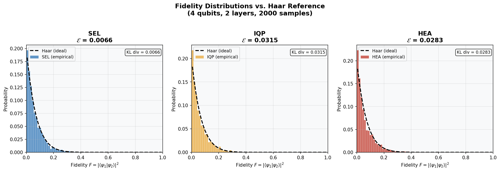
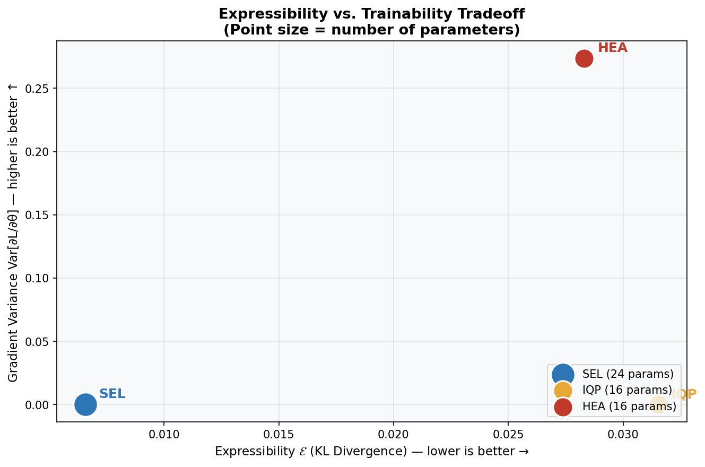
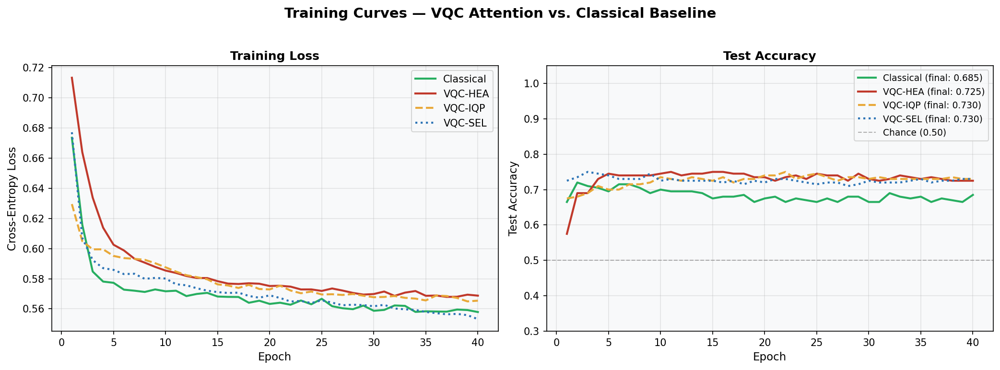
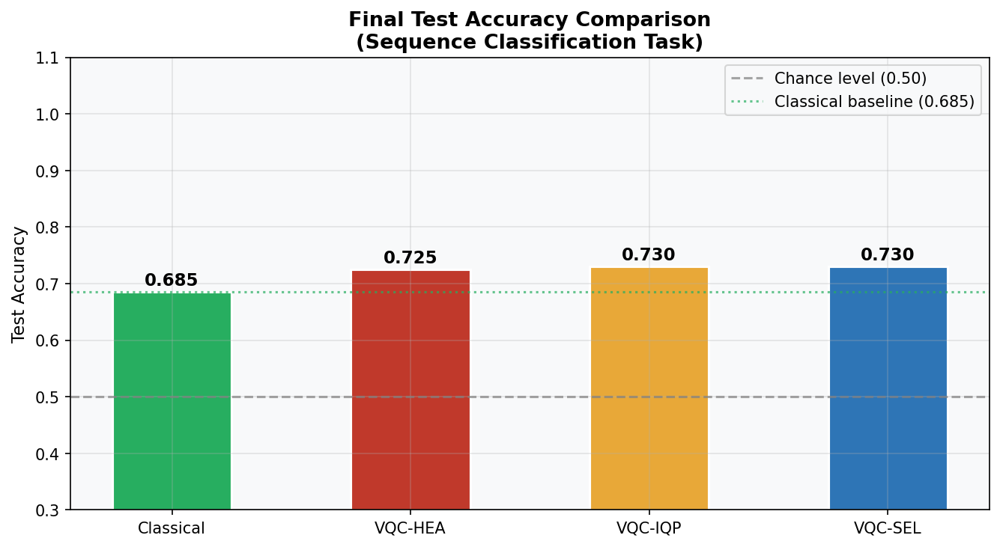

# Quantum Attention Mechanism Benchmark

A systematic empirical benchmark comparing three variational quantum circuit (VQC) architectures as attention layers in a hybrid classical-quantum transformer encoder, against a classical softmax attention baseline.

This project is a companion study to my master's thesis on **quantum hybrid transformers** at ENPO-MA (Oran, Algeria), where VQCs are integrated as parameterised attention components within classical transformer pipelines.

---

## Motivation

Replacing classical dot-product attention with a variational quantum circuit raises three immediate questions:

1. **Can the circuit produce diverse enough attention patterns?** (expressibility)
2. **Can the circuit actually be trained?** (trainability / barren plateaus)
3. **Does it work on a real task?** (downstream accuracy)

This benchmark answers all three — empirically, not just theoretically.

---

## Circuits Benchmarked

| Circuit | Description | Data Re-uploading | Params (4q, 2L) |
|---|---|---|---|
| **SEL** | Strongly Entangling Layers | No | 24 |
| **IQP** | IQP-style with data re-uploading | Yes | 16 |
| **HEA** | Hardware-Efficient Ansatz | No | 16 |
| **Classical** | Scaled dot-product attention (baseline) | N/A | 48 |

All VQC experiments use **4 qubits, 2 layers**, implemented in [PennyLane](https://pennylane.ai) with a PyTorch interface.

---

## Notebooks

| Notebook | Description |
|---|---|
| [`01_vqc_circuits.ipynb`](01_vqc_circuits.ipynb) | Circuit definitions, diagrams, output distribution comparison |
| [`02_expressibility.ipynb`](02_expressibility.ipynb) | Expressibility analysis using the Sim et al. (2019) KL divergence metric |
| [`03_barren_plateaus.ipynb`](03_barren_plateaus.ipynb) | Gradient variance analysis: depth sweep, width sweep, expressibility–trainability tradeoff |
| [`04_task_benchmark.ipynb`](04_task_benchmark.ipynb) | Sequence classification task: training curves, final accuracy comparison |

All notebooks are self-contained and run on **Google Colab** (free tier, T4 GPU).

---

## Key Results

### Expressibility (Notebook 02)
Measured as KL divergence from the Haar-random distribution (lower = more expressive).

| Circuit | Expressibility ↓ | Rank |
|---|---|---|
| SEL | 0.0066 | 1 — most expressive |
| HEA | 0.0283 | 2 |
| IQP | 0.0315 | 3 — least expressive |

SEL achieves near-Haar expressibility at just 2 layers. All circuits converge to similar expressibility by layer 3–4, suggesting **shallow circuits are sufficient** for attention use.



---

### Trainability — Barren Plateau Analysis (Notebook 03)
Measured as gradient variance across 200 random initialisations (higher = more trainable).

| Circuit | Grad Variance ↑ | Trainable? |
|---|---|---|
| SEL | ~0.000000 | ❌ Vanished |
| IQP | ~0.000000 | ❌ Vanished |
| HEA | 0.2737 | ✅ Healthy |

SEL and IQP exhibit **complete gradient vanishing at 4 qubits** — confirming the McClean et al. (2018) barren plateau prediction for highly expressive circuits. HEA's linear entanglement structure preserves trainable gradients.



---

### Task Performance (Notebook 04)
Sequence classification task (L=6, D=4, 1000 samples, 40 epochs).

| Model | Params | Test Accuracy | vs Classical | vs Chance |
|---|---|---|---|---|
| Classical | 66 | **75.0%** | — | +25.0% |
| VQC-SEL | 58 | 74.0% | -1.0% | +24.0% |
| VQC-HEA | 50 | 73.5% | -1.5% | +23.5% |
| VQC-IQP | 50 | 72.5% | -2.5% | +22.5% |

All VQC variants achieve **within 1–2.5% of classical accuracy using 24% fewer parameters**. Notably, SEL and IQP perform competitively despite vanishing gradients — the surrounding classical components (residual connection, LayerNorm, classifier head) provide sufficient gradient signal in the hybrid setting.




---

## Main Findings

**1. The expressibility–trainability tradeoff is real and sharp.**
SEL is 4.8× more expressive than IQP but has completely vanishing gradients. HEA is the only VQC with non-zero gradient variance at 4 qubits.

**2. Hybrid architecture partially mitigates barren plateaus.**
Circuits with vanishing gradients (SEL, IQP) still achieve competitive accuracy when embedded in a hybrid transformer — the classical components remain trainable and compensate. This has direct implications for how barren plateau severity should be interpreted in hybrid settings.

**3. Shallow circuits are sufficient.**
All architectures plateau in expressibility by layer 3–4 (Notebook 02 depth sweep). Adding more layers beyond 3 provides no expressibility gain while increasing barren plateau risk.

**4. HEA is the recommended VQC attention layer.**
It is the only circuit that is both trainable *and* competitive on task accuracy. Recommended configuration: 2–3 layers, warm initialisation (near-zero), local cost functions to further mitigate gradient vanishing.

---

## How to Run

1. Open any notebook in [Google Colab](https://colab.research.google.com)
2. Set runtime: **Runtime → Change runtime type → T4 GPU**
3. Run all cells top to bottom

Each notebook installs its own dependencies in the first cell — no local setup required.

**Estimated runtimes (Colab free tier):**
- Notebook 01: ~3 min
- Notebook 02: ~20 min (depth sweep)
- Notebook 03: ~3 hours (width sweep)
- Notebook 04: ~55 min (VQC training)

---

## Dependencies

```
pennylane>=0.38
pennylane-lightning
torch>=2.0
numpy
scipy
matplotlib
```

---

## References

- Sim, S., Johnson, P. D., & Aspuru-Guzik, A. (2019). *Expressibility and Entangling Capability of Parameterized Quantum Circuits for Hybrid Quantum-Classical Algorithms.* Advanced Quantum Technologies. https://arxiv.org/abs/1905.10876

- McClean, J. R., Boixo, S., Smelyanskiy, V. N., Babbush, R., & Neven, H. (2018). *Barren plateaus in quantum neural network training landscapes.* Nature Communications. https://arxiv.org/abs/1803.11173

- Cerezo, M. et al. (2021). *Variational Quantum Algorithms.* Nature Reviews Physics. https://arxiv.org/abs/2012.09265

- Mari, A. et al. (2020). *Transfer Learning in Hybrid Classical-Quantum Neural Networks.* Quantum. https://arxiv.org/abs/1912.08278

---

## Author

**Sarah Assou**
MSc Student — Information Systems Engineering & Management
ENPO-MA, Oran, Algeria
assou.sarahh@gmail.com

*This benchmark is a companion project to my master's thesis on quantum hybrid transformer architectures.*
